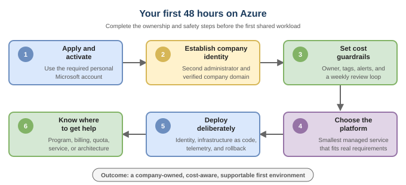

# Azure Startup Field Guide

> The opinionated, community-maintained field guide for startups building on
> Azure, from first credit to production scale.

**Not a list of links. A path through them.**

Azure has excellent documentation, but a founder should not need to understand
Microsoft's product taxonomy before creating a usable company environment.
This guide connects the official documentation into practical, stage-aware
journeys and calls out the decisions that are difficult to undo later.

## Start here

| Your situation | Recommended path |
|---|---|
| I am applying or activating startup credits | [Application and account setup](journeys/first-48-hours/01-apply-and-activate.md) |
| I received credits and want to deploy now | **Pause first:** [attach the environment to your company](journeys/first-48-hours/02-company-identity.md) |
| My account, tenant, credits, or portal are not working | [Find the right support path](journeys/first-48-hours/05-get-help.md) |
| I am worried about unexpected spend | [Set cost guardrails](journeys/first-48-hours/03-cost-guardrails.md) |
| My account is ready and I want a sensible foundation | [Deploy deliberately](journeys/first-48-hours/04-build-foundation.md) |
| I need a broader technical checklist | [Azure Digital Natives Guide](https://azdnguide.com/) |
| I need a startup-sized landing zone | [Startup-Scale Landing Zone](https://startupscalelanding.zone/) |

## The first 48 hours

1. [Understand the journey](journeys/first-48-hours/README.md)
2. [Apply and activate](journeys/first-48-hours/01-apply-and-activate.md)
3. [Establish company identity](journeys/first-48-hours/02-company-identity.md)
4. [Set cost guardrails](journeys/first-48-hours/03-cost-guardrails.md)
5. [Build the foundation](journeys/first-48-hours/04-build-foundation.md)
6. [Get the right help](journeys/first-48-hours/05-get-help.md)

## Guide map

| Area | What it answers | Status |
|---|---|---|
| [First 48 hours](journeys/first-48-hours/) | How do I get from application to a safe first deployment? | Available |
| [Microsoft for Startups program](program/) | Which portal, account, credits, and support path apply to me? | Available |
| [Decisions](decisions/) | Which technology should I choose, and when should I revisit it? | Starting |
| [Curated resources](resources/) | Which official and community resources are worth my time? | Available |
| Architecture patterns | What should common startup workloads look like? | Planned |
| MVP to product-market fit | What should change when the product gains traction? | Planned |
| Enterprise readiness | How do I prepare for larger customers and compliance? | Planned |

See the [public roadmap](ROADMAP.md) for planned work.

## Principles

- **Journey before catalog.** Start with the problem a founder is solving.
- **Official sources first.** Technical claims link to current Microsoft
  documentation.
- **Opinion with an exit condition.** Recommendations explain when they stop
  being appropriate.
- **Startup-sized defaults.** Do not introduce enterprise complexity without a
  requirement.
- **Freshness is a feature.** Links and time-sensitive guidance are reviewed
  continuously.
- **Community content is labeled.** Microsoft employee-authored and independent
  resources are not presented as official Microsoft documentation.

## Why this exists

This project was prompted by a
[public r/AZURE thread](https://www.reddit.com/r/AZURE/s/SrAkEoi25f) in which a
founder wanted to use Azure but encountered account, tenant, credit, and support
friction before deploying a workload. The thread is a signal, not a source of
technical truth. The fixes and recommendations in this guide are grounded in
the current Microsoft for Startups and Microsoft Learn documentation.

The goal is not to defend a difficult experience. It is to make the correct
path visible before another founder loses a day discovering it.

## Source labels

| Label | Meaning |
|---|---|
| **Official Microsoft** | Published on a Microsoft-owned site or GitHub organization |
| **Microsoft community** | Created by a Microsoft employee in a personal or community capacity |
| **Community** | Independent resource reviewed for relevance and technical quality |

## Contributing

Founders, engineers, investors, Microsoft employees, and community experts are
welcome. Start with [CONTRIBUTING.md](CONTRIBUTING.md) and the
[editorial standards](EDITORIAL.md). If a recommendation failed at your stage,
please open a [stage feedback issue](https://github.com/Azure-Startup-Field-Guide/guide/issues/new?template=stage-feedback.yml).

## Disclaimer

This is an independent, community-maintained project. It is not official
Microsoft documentation and is not endorsed by Microsoft. Microsoft, Azure,
GitHub, and related product names are trademarks of the Microsoft group of
companies. Program terms, service availability, pricing, quotas, and preview
status can change. Always verify time-sensitive details in the linked official
documentation.
