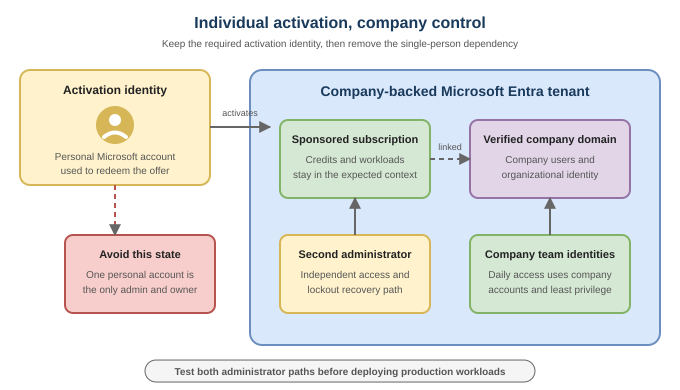

# 2. Attach the environment to your company

> **Verified in the August 16, 2026 repository audit against current official
> Microsoft documentation.**

## The recommendation

Keep the individual Microsoft account required for credit activation, then
establish company identity and resilient administration before deploying
workloads.

This is the most important step in the guide.

The startup credits remain tied to the Microsoft account used for redemption;
current program FAQs say they cannot be transferred to another Microsoft
account. Preserve that activation identity while moving daily administration,
recovery, and team access to company-controlled identities.

## Complete these actions

### 1. Create a second administrative account

Create a second administrative identity for a co-founder or designated
administrator and assign the permissions required by the official setup guide.
Test that both identities can sign in.

This account reduces the chance that the environment becomes inaccessible when
the activating founder is unavailable or leaves the company.

### 2. Add the company domain to Microsoft Entra ID

Add and verify a domain owned by the company. Verification requires a DNS
record, so coordinate with whoever manages the domain registrar.

### 3. Move daily administration to company identities

Create company-domain identities for administrators and team members. Do not
rename or remove the personal Microsoft account used to activate the offer
without following the official guidance and, when needed, working with support.

### 4. Test the recovery path

Before continuing:

- sign in with the second administrator;
- confirm access to the tenant and sponsored subscription;
- verify that the company domain is the intended primary domain;
- record the tenant ID and subscription ID in a private operational register;
- confirm at least two people know how to recover administrative access.

## Definition of done

- [ ] Sponsored subscription is visible under the expected tenant
- [ ] Second administrator can sign in independently
- [ ] Company domain is added and verified
- [ ] Team members use company identities for normal work
- [ ] Ownership and recovery details are stored privately

## What not to do

- Do not leave the environment owned only by a founder's personal account.
- Do not put credentials or recovery codes in source control.
- Do not create multiple tenants as a troubleshooting shortcut.
- Do not transfer, rename, or delete the activating identity based on a forum
  workaround.
- Do not grant broad roles to every developer because it is faster today.

## Next

Continue to [3. Set cost guardrails](03-cost-guardrails.md).

## Official sources

- [Properly Setting Up Your Azure Account](https://learn.microsoft.com/en-us/startups/build/azure-getting-started/set-up-account)
- [Microsoft for Startups FAQ](https://learn.microsoft.com/en-us/startups/microsoft-for-startups/mfs-faqs)
- [Add a custom domain name](https://learn.microsoft.com/en-us/entra/fundamentals/add-custom-domain)
- [Manage custom domain names](https://learn.microsoft.com/en-us/entra/identity/users/domains-manage)
- [Add or change Azure subscription administrators](https://learn.microsoft.com/en-us/azure/cost-management-billing/manage/add-change-subscription-administrator)
