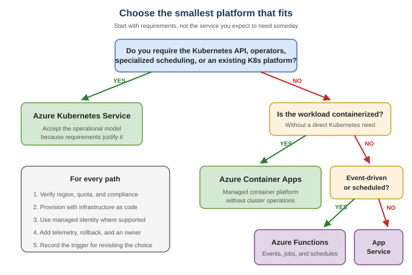

# 4. Build the smallest foundation that can grow

> **Verified in the August 16, 2026 repository audit against current official
> Microsoft documentation.**

## The recommendation

Choose the simplest managed platform that satisfies a concrete requirement.
Do not begin with Kubernetes, private networking, or an enterprise-scale
landing zone solely because you expect the company to grow.

## Match the workload to the platform

| Workload need | Start by evaluating |
| --- | --- |
| Web application or HTTP API | Azure App Service |
| Event-driven task or scheduled function | Azure Functions |
| Containerized service without direct Kubernetes requirements | Azure Container Apps |
| Kubernetes API, operators, specialized scheduling, or an existing Kubernetes platform | Azure Kubernetes Service |
| Relational application data | Azure Database for PostgreSQL, Azure SQL Database |
| Globally distributed NoSQL data | Azure Cosmos DB |
| Secrets, keys, and certificates | Azure Key Vault |
| Application telemetry | Azure Monitor and Application Insights |

This is a decision sequence, not a universal architecture. Validate service,
region, quota, compliance, and workload requirements before committing.

## Use infrastructure as code from the first shared environment

The first production-like environment should be reproducible. Prefer:

- Azure Verified Modules when a suitable module exists;
- Bicep or Terraform checked into the application or platform repository;
- workload identity federation for CI/CD rather than stored client secrets;
- separate development and production boundaries appropriate to the team's
  risk; and
- a deployment path that includes telemetry and rollback.

Azure Developer CLI (`azd`) can connect application code, infrastructure, and
deployment workflows for supported templates. Review a template before using
it; a deploy button is not an architecture review.

## Decide how much landing zone you need

For an opinionated startup-sized baseline, review the community-maintained
[Startup-Scale Landing Zone](https://startupscalelanding.zone/). For
enterprise-scale governance and complex organizational requirements, use the
official [Azure landing zone](https://learn.microsoft.com/en-us/azure/cloud-adoption-framework/ready/landing-zone/)
guidance.

Choose based on current constraints and known near-term requirements. Document
the conditions that will trigger a move to a more complex platform.

## Production-readiness questions

- Can another engineer deploy the environment from source control?
- Are application identities using least privilege?
- Are secrets outside code and deployment logs?
- Can you identify the owner and cost of each resource?
- Will a failure produce an actionable signal?
- Can you restore data and roll back a release?
- What requirement would force the next architecture change?

## Next

Read [5. Get the right help](05-get-help.md) before you need it.

## Official sources

- [Platform Foundations for Startups](https://learn.microsoft.com/en-us/startups/build/infra/platform-foundations)
- [Azure Developer CLI overview](https://learn.microsoft.com/en-us/azure/developer/azure-developer-cli/overview)
- [Azure Verified Modules](https://aka.ms/AVM)
- [Azure Well-Architected Framework](https://learn.microsoft.com/en-us/azure/well-architected/)
- [Azure landing zones](https://learn.microsoft.com/en-us/azure/cloud-adoption-framework/ready/landing-zone/)
