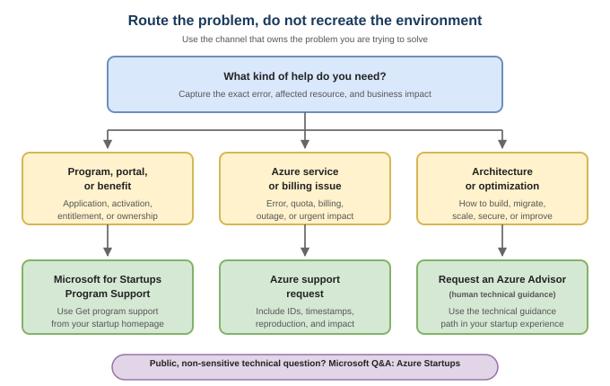

# 5. Use the right support path

> **Verified in the August 16, 2026 repository audit against current official
> Microsoft documentation.**

Do not wait until an outage to learn which team handles which problem.

## Support map

| Need | Route |
| --- | --- |
| Application problem before the Azure account exists | [Microsoft for Startups program support](https://aka.ms/startuphelp-mfs-portal) |
| Credit activation, benefit redemption, billing profile, entitlement, or startup portal access | **Get Program Support** in the Microsoft for Startups experience |
| Azure error, quota, billing, subscription, or urgent service issue | [Create an Azure support request](https://learn.microsoft.com/en-us/azure/azure-portal/supportability/how-to-create-azure-support-request) |
| Architecture, migration, optimization, or design guidance | Request an Azure Advisor through the startup experience |
| Technical question that can be discussed publicly | [Microsoft Q&A: Azure Startups](https://learn.microsoft.com/en-us/answers/tags/503/azure-startups) |
| Service health or production incident | Azure Service Health and the support plan attached to the subscription |

## Your portal depends on when you joined

The current Microsoft documentation describes two program experiences:

- **Joined before May 29, 2026:** use the
  [Microsoft for Startups portal](https://portal.startups.microsoft.com/login)
  for advisor pairing and the applicable program workflow.
- **Joined on or after May 29, 2026:** use the startup overview in the
  [Azure portal](https://portal.azure.com/) and the **Your Microsoft team**
  section.

Follow the current official support page if your interface differs.

## "Azure Advisor" means a person in the startup program

Microsoft for Startups uses **Azure Advisor** for a human technical specialist
who can help with architecture, migration, and optimization. This is different
from the [Azure Advisor product](https://learn.microsoft.com/en-us/azure/advisor/advisor-overview),
which analyzes resource configuration and usage telemetry to produce automated
recommendations.

## Make a support request actionable

Include:

- the exact UTC time and region;
- tenant and subscription IDs, not credentials;
- the service and resource type;
- the complete error message and correlation/request ID;
- steps to reproduce;
- expected versus actual behavior;
- business impact and deadline; and
- what you already tried.

Redact secrets, tokens, personal data, customer data, and payment details from
screenshots and public questions.

## If you cannot create a ticket

If account or portal state prevents ticket creation, use
[program support](https://aka.ms/startuphelp-mfs-portal) rather than creating
another tenant or subscription as a workaround.

## Official sources

- [Technical Guidance and Support Overview](https://learn.microsoft.com/en-us/startups/benefits/technical-benefits/technical-support)
- [Microsoft for Startups Program Support](https://learn.microsoft.com/en-us/startups/microsoft-for-startups/mfs-program-support)
- [Microsoft for Startups FAQ](https://learn.microsoft.com/en-us/startups/microsoft-for-startups/mfs-faqs)
- [Create an Azure support request](https://learn.microsoft.com/en-us/azure/azure-portal/supportability/how-to-create-azure-support-request)
